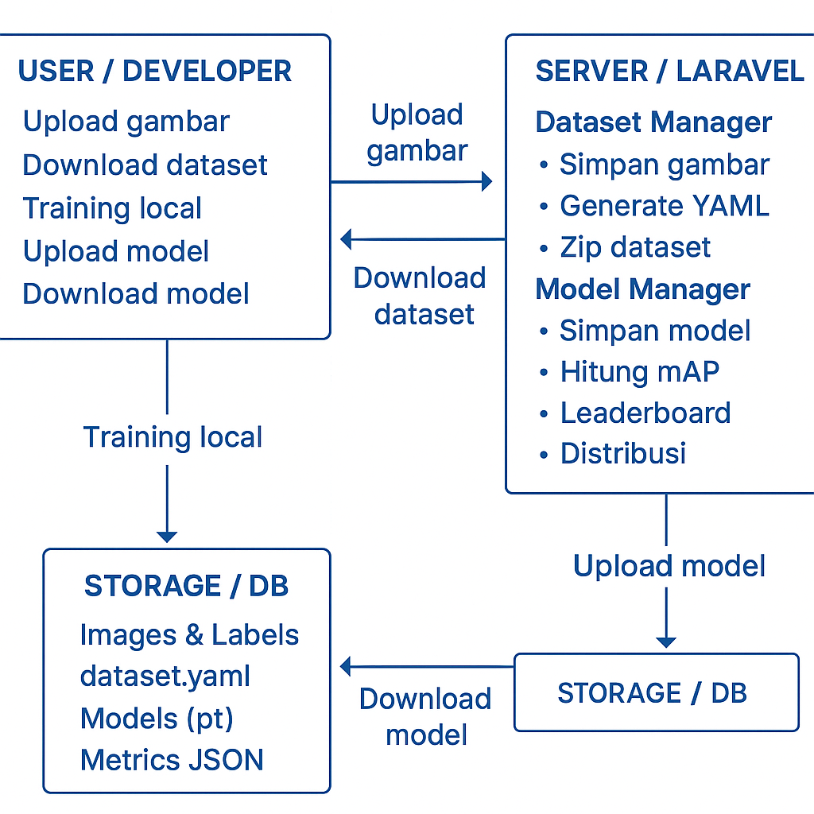

# 📘 Implement dataset pepaya
Pada coding tema ini kita akan implement dataset yang ada, sebelum mulai
kita coba install requermentnya

```bash
python3 --version

brew install python@3.11
brew link python@3.11

python3.11 -m venv yolovenv
source yolovenv/bin/activate

pip install --upgrade pip setuptools wheel
pip install torch torchvision torchaudio
pip install ultralytics opencv-python matplotlib

python -c "from ultralytics import YOLO; YOLO('yolov8n.pt')('https://ultralytics.com/images/bus.jpg').show()"
```
# download yolov8n.pt
wget https://github.com/ultralytics/assets/releases/download/v0.0.0/yolov8n.pt

ls -lh yolov8n.pt

Harusnya ukurannya sekitar 6 MB.

# Catatan: testing1.py
yolov8n.pt → YOLO akan otomatis download kalau belum ada.
runs/detect/train/weights/best.pt → hasil training disimpan di sini.
data.yaml → pastikan sudah benar (names: ['pepaya']).
Tambahan os.path.exists supaya lebih jelas kalau file tidak ketemu.

# Tips: testing2.py
conf=0.5 → filter prediksi dengan confidence rendah.
iou=0.45 → atur seberapa besar overlap box dianggap sama objek. Kalau masih double, coba turunkan ke 0.3.
Kalau dataset pepaya hanya 1 objek per gambar, bisa set lebih ketat

# Hasilnya testing3.py

Gambar dengan bounding box pepaya → runs/detect/pepaya_test/
Koordinat bounding box (YOLO format) → runs/detect/pepaya_test/labels/
# ⚡ Tips:
Kalau hasil masih banyak box ganda → coba naikkan conf=0.6 dan turunkan iou=0.3.

# Cara Kerja testing4.py

model.track() → YOLOv8 + tracker (default ByteTrack).
persist=True → ID objek dipertahankan antar frame. Jadi pepaya yang sama tidak dihitung berkali-kali walaupun terlihat terus di kamera.
Hasilnya: pepaya akan muncul dengan ID unik (id=0, id=1, dst).

Kalau CCTV pakai RTSP, ganti:
cap = cv2.VideoCapture("rtsp://user:pass@ip:port/stream")

# Penjelasan testing5.py

YOLOv8 + ByteTrack → melacak pepaya antar frame.
unique_ids (set) → memastikan pepaya dihitung sekali saja.
pepaya_log.txt → menyimpan jumlah pepaya unik + timestamp.
Kalau mau pakai RTSP CCTV, tinggal ganti cap = cv2.VideoCapture("rtsp://...").

# Penjelasan testing6.py
pip install mysql-connector-python

CREATE DATABASE pepaya_db;
USE pepaya_db;

CREATE TABLE deteksi_pepaya (
    id INT AUTO_INCREMENT PRIMARY KEY,
    timestamp DATETIME NOT NULL,
    jumlah_pepaya INT NOT NULL
);

```

python3.11 -c "import cv2, numpy; print(cv2.__version__, numpy.__version__)"
4.8.1.78 1.26.4

pip uninstall -y opencv-python
pip install opencv-python==4.8.1.78

pip uninstall -y numpy
pip install numpy==1.26.4
```
# Keterangan gambar strukture flow proses
Alurnya (Step by Step)
User → Server: Upload dataset (gambar pepaya + label).
Server → DB: Simpan data + update dataset.yaml.
User → Server: Download dataset terbaru (zip).
User (local GPU): Training YOLOv8 → hasil best.pt.
User → Server: Upload hasil training (best.pt, results.json).
Server: Evaluasi, update leaderboard.
User → Server: Download model terbaik untuk inference.

### 1. Deteksi Objek Umum (COCO dataset)


### Buat File Systemd Service

sudo nano /etc/systemd/system/yolo.service
```
[Unit]
Description=YOLO Python Service
After=network.target

[Service]
User=username
WorkingDirectory=/home/username/myproject
ExecStart=/home/username/myproject/venv/bin/python /home/username/myproject/testing_app.py
Restart=always

[Install]
WantedBy=multi-user.target
```
### Reload & Enable Service
```
sudo systemctl daemon-reload
sudo systemctl enable yolo.service
sudo systemctl start yolo.service

```